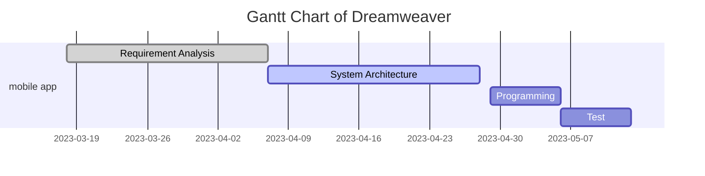

# This is the page for GUI team of distributed development of software between JLU and UTAD.
Hello, everyone!

[This is the organization of our group on GitHub.](https://github.com/DreamweaverDSD)

# our team members

Project manager / Programmer [Donald](https://github.com/Ishida-Mitsunari)

System Architect / Tester [Vasco](https://github.com/VascoRR001)

Requirement Analyst / Programmer [Caroline](https://github.com/Asherious0)

Requirement Analyst / Programmer [Durable](https://github.com/Durable01)

Liaison / Programmer [Henry](https://github.com/3074239390)

System Architect / Tester [Pedro](https://github.com/orgs/DreamweaverDSD/people/al70649)

# DSD Calendar
This is the [calendar](https://github.com/michro/DSD/blob/fbfffbce1ffe1a65abc483b6da931d37942e02de/Calendar2023.pdf)

# News
Week 1: \
[First Draft of Requirement analysis](https://github.com/DreamweaverDSD/DSD/tree/main/requirement_analyze)

Week 2: \
[Sixth Version of Requirement analysis](https://github.com/DreamweaverDSD/DSD/tree/main/requirement_analyze)

Week 3:\
4.1 Decide to start the system architecture\
4.4 [First Draft of System Architecture](https://github.com/DreamweaverDSD/DSD/blob/main/ClassDiagramExplained.md)

Week 4:\
4.6 confirm with server group\
4.7 [Second Draft of System Architecture](https://github.com/DreamweaverDSD/DSD/blob/main/ClassDiagramExplained.md)\
4.9 [Third Draft of System Architecture](https://github.com/DreamweaverDSD/DSD/blob/main/ClassDiagramExplained.md)\
4.11 [GUI APP version 20230411](https://github.com/DreamweaverDSD/DSD/blob/main/GUI_APP/Introduction%20of%20GUI%20apps%20of%20version%202023-04-11.md)\
4.12 [GUI APP version 20230412](https://github.com/DreamweaverDSD/DSD/blob/main/GUI_APP/Introduction%20of%20GUI%20apps%20of%20version%202023-04-12.md)\
4.12 [GUI APP version 20230412(2)](https://github.com/DreamweaverDSD/DSD/blob/main/GUI_APP/Introduction%20of%20GUI%20apps%20of%20version%202023-04-12(2).md)

Week 5:\
4.15 In the group meeting, we discussed about the connection of equipment and the process of getting data in system architecture.\
4.16 Communicate with Bob and make clear the format of json data in LoginCheck, AccountRegister, AccountInformation, SetAccountInformation, BindDevice and UnbindDevice\
4.19 [GUI APP version 20230419](https://github.com/DreamweaverDSD/DSD/tree/main/GUI_APP/20230419)\
4.20 [Fourth Draft of System Architecture](https://github.com/DreamweaverDSD/DSD/blob/main/ClassDiagramExplained.md)

Week 6:\
4.29 In the group meeting we discussed [what needed to be modified in SA](https://github.com/DreamweaverDSD/DSD/blob/main/meetings/4.29.pdf) after communicating with Server Group.\
4.30 [Fifth Draft of System Architecture](https://github.com/DreamweaverDSD/DSD/blob/main/ClassDiagramExplained.md)

Week 7:\
5.3 [The use case of Requirement Analysis of second iterator](https://github.com/DreamweaverDSD/DSD/blob/main/Require%20Analysis%202/UserUseDiagram.jpg)

# The Gantt chart of our group

