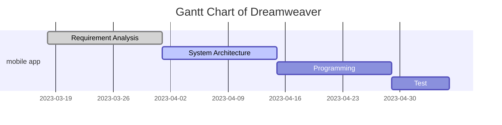

# This is the page for GUI team of distributed development of software between JLU and UTAD.
Hello, everyone!

[This is the organization of our group on GitHub.](https://github.com/DreamweaverDSD)

# our team members

Project manager / Programmer [Donald](https://github.com/Ishida-Mitsunari)

System Architect / Tester [Vasco](https://github.com/VascoRR001)

Requirement Analyst / Programmer [Caroline](https://github.com/Asherious0)

Requirement Analyst / Programmer [Durable](https://github.com/Durable01)

Liaison / Programmer [Henry](https://github.com/3074239390)

System Architect / Tester [Pedro](https://github.com/orgs/DreamweaverDSD/people/al70649)

# DSD Calendar
This is the [calendar](https://github.com/michro/DSD/blob/fbfffbce1ffe1a65abc483b6da931d37942e02de/Calendar2023.pdf)

# News
Week 1: [First Draft of Requirement analysis](https://github.com/DreamweaverDSD/DSD/tree/main/requirement_analyze)

Week 2: [Sixth Version of Requirement analysis](https://github.com/DreamweaverDSD/DSD/tree/main/requirement_analyze)

Week 3: [First Draft of System Architecture](https://media.discordapp.net/attachments/1085545028354576386/1092853929882173480/image.png?width=740&height=556)

# The Gantt chart of our group

